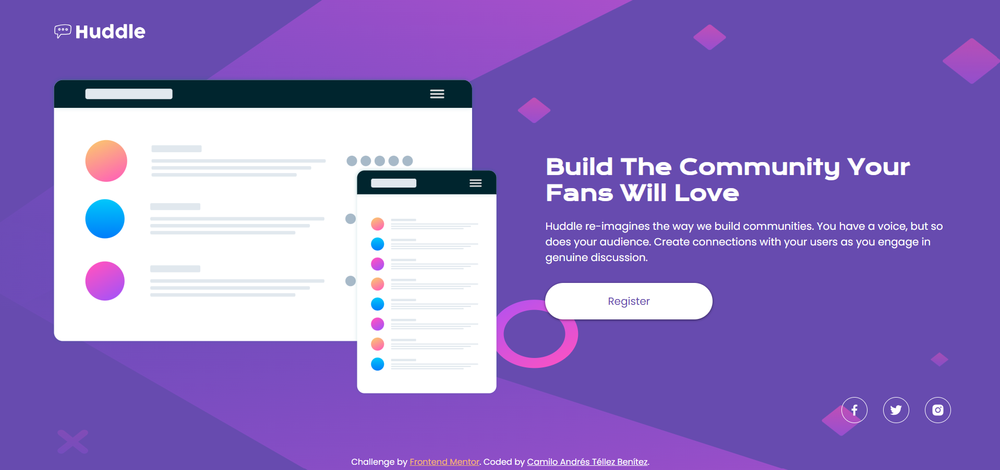

# Frontend Mentor - Huddle Landing Page con Sección de Introducción

Esta es mi solución al desafío [Huddle landing page with single introductory section challenge en Frontend Mentor](https://www.frontendmentor.io/challenges/huddle-landing-page-with-a-single-introductory-section-B_2Wvxgi0).

## Tabla de contenidos

- [Descripción General](#descripción-general)
  - [El desafío](#el-desafío)
  - [Captura de pantalla](#captura-de-pantalla)
  - [Enlaces](#enlaces)
- [Mi proceso](#mi-proceso)
  - [Tecnologías utilizadas](#tecnologías-utilizadas)
  - [Lo que aprendí](#lo-que-aprendí)
- [Autor](#autor)
- [Agradecimientos](#agradecimientos)

## Descripción General

### El desafío

El objetivo principal de este proyecto era lograr que los usuarios pudieran:

- Ver el diseño óptimo de la página, independientemente del tamaño de la pantalla del dispositivo.

### Captura de pantalla

A continuación, muestro el resultado del proyecto en una pantalla de escritorio:

 

### Enlaces

- URL del proyecto publicado: [Aquí estará el enlace del sitio en GitHub Pages](https://your-live-site-url.com)

## Mi proceso

### Tecnologías utilizadas

En este proyecto utilicé las siguientes herramientas y tecnologías:

- **HTML5 semántico** para una estructura clara y accesible.
- **Propiedades personalizadas de CSS** para mantener consistencia en los estilos.
- **Flexbox** para manejar los diseños flexibles y adaptables.
- Un enfoque **mobile-first** para garantizar una buena experiencia en dispositivos móviles.

### Lo que aprendí

En este proyecto reforcé mi conocimiento sobre diseño adaptable y las mejores prácticas para trabajar con Flexbox. También aprendí a implementar diseño responsivo utilizando media queries, lo que me permitió adaptar los estilos de la página a diferentes tamaños de pantalla.

## Autor

- LinkedIn - [Camilo Andrés Téllez Benítez](http://www.linkedin.com/in/camilo-téllez)
- Frontend Mentor - [@camilo-atb](https://www.frontendmentor.io/profile/camilo-atb)
- YouTube - [Camilo Téllez](https://www.youtube.com/@camilotellez887)

## Agradecimientos

Este proyecto lo desarrollé con el apoyo del Bootcamp Premium de Desarrollo Web Frontend de **Código Facilito**. Aunque ya tenía conocimientos en Flexbox, las clases del Bootcamp me ayudaron a complementar mis conocimientos, reforzar conceptos clave y aprender nuevos temas para llevar este proyecto a cabo con éxito.
